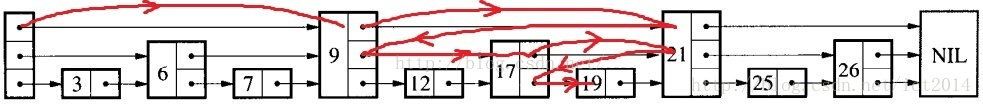
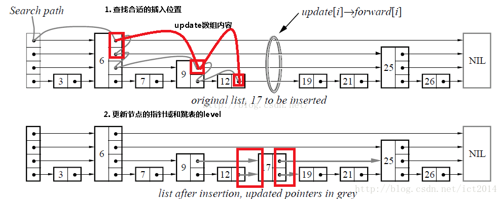
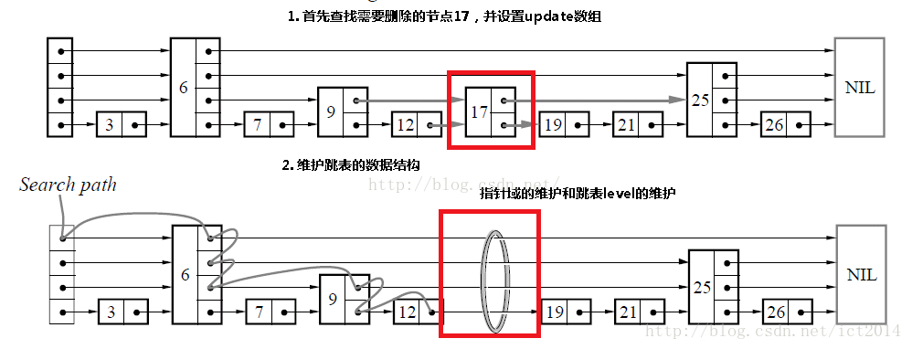

# Probabilistic-Skip-List
A skip list implementation written in rust

All operations (insert, delete, search) will be 

# Searching

Search for the node 19

# Insertion

Insert node 17 

# Deletion

Delete node 17
